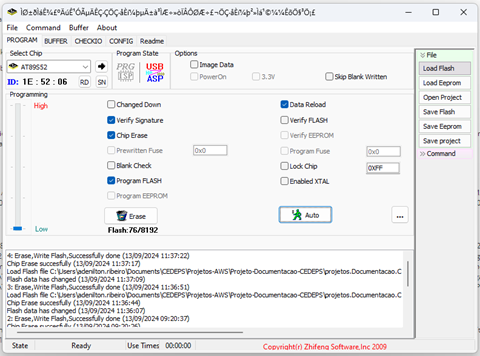
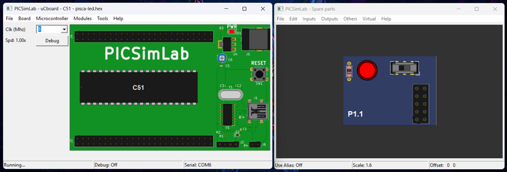

# _Pisca Led_


---

## Sumário

- [Histórico de Versão](#histórico-de-versão)
- [Resumo](#resumo)
- [Links para estudos](#links-para-estudos)
- [Fluxograma](#fluxograma)
    - [Configuração do Gravador USBASP](#configuração-do-gravador-usbasp)
    - [ATMEL AT89S52](#atmel-at89s52)
    - [Pinos do projeto eletrônico](#pinos-do-projeto-eletrônico)
- [Configuração do simulador SIMUIIDE](#configuração-do-simulador-simuiide)
- [Configuração do Firmware](#configuração-do-firmware)
- [Informações](#informações)

## Histórico de Versão

| Versão | Data       | Autor       | Descrição         |
|--------|------------|-------------|-------------------|
| 1.0.0  | 03/07/2025 | Adenilton R | Início do Projeto |

## Resumo

Este documento tem como objetivo demonstrar como configurar o simulador SIMUIIDE para executar um firmware que controla o estado de um LED em um microcontrolador, fazendo-o piscar a cada 500ms.

## Links para estudos

[Informações do ATMEL AT89S52;](https://www.microchip.com/en-us/product/at89s52)

[Datasheet do microcontrolador;](https://ww1.microchip.com/downloads/en/DeviceDoc/doc1919.pdf)

[Vídeo de configuração do ambiente;](https://www.youtube.com/watch?v=QY_adW902Uw&t)

[Site de compra do ATMEL AT89S52;](https://www.saravati.com.br/microcontrolador-at89s52-24pu-dip-40-pin.html)

## Fluxograma


### Configuração do Gravador USBASP

USBasp é um gravador para controladores Atmel AVR com uma conexão USB construída em sua placa. É constituído de um ATMega8 e outros simples componentes eletrônicos. O gravador apenas utiliza de um driver USB para comunicação, não sendo necessário um controlador USB especial.


Esquemático eletrônico:


**Informações Técnicas:**

- **`Funciona em diversos sistemas operacionais:`** Linux, Mac OS X e Windows (32 e 64 Bits);
- Permite a leitura ou escrita na EEPROM do microcontrolador, firmware, fuse bits e lock bits;
- Velocidade de programação é maior que 5kBytes/seg;
- Opção de modo lento SCK para alvos com baixo clock (<1.5Mhz);
- Interface ISP 10 pinos;
- Dimensões: 7cm x 2cm;

Para atualizar o software, baixe o [**`ZADIG-2.9`**](https://github.com/pbatard/libwdi/releases/tag/v1.5.1) e siga o passo a passo para a atualização no [**`USBASP`**](https://www.instructables.com/USBASP-Installation-in-Windows-10/).

Para o software de gravação, assista ao vídeo [**`Como gravar um 8051 com USBASP`**](https://www.youtube.com/watch?v=EKlpHcpSUzQ) e baixe o arquivo no [**`AVR ProgISP Programmer`**](https://github.com/ioelectro/avr-progisp-programmer).



### ATMEL AT89S52

O **AT89S52** é um microcontrolador de 8 bits de baixo consumo de energia e alto desempenho, com 8 KB de memória Flash programável internamente. Fabricado pela Atmel, é compatível com o conjunto de instruções e a pinagem padrão da arquitetura 8051. Ele permite reprogramação no sistema ou através de um programador externo.


Esquemático eletrônico.


**Informações Técnicas:**

- **`Modelo:`** AT89S52-24PU DIP 40 Pin;
- **`Encapsulamento:`** PDIP 40 Pin (Plastic Dual In line Package);
- **`Terminais:`** 40 pinos;
- **`Faixa de Operação de`**: 4,0 V a 5,5 V;
- **`Memória Flash:`** 8 KB de memória flash programável (para armazenagem de código);
- **`Memória RAM:`** 256 Bytes;
- **`Tipo de Memória:`** EEPROM;
- **`Clock:`** 0 Hz a 33 MHz;
- Interface serial de comunicação (UART);
- **`Corrente de saída:`** 15 mA;
- **`Entradas e saídas digitais:`** 32 divididas em 4 ports de 8 bits cada;
- Dois temporizadores/contadores de 16 bits;
- **`Durabilidade:`** 10.000 ciclos de gravação/apagamento;
- **`Temperatura de operação:`** -40 a 85 Graus Celsius;
- **`Cor:`** Preto;
- **`Tamanho:`** 55mm Largura x 15mm Profundidade x 4mm Altura;
- **`Peso:`** 5g;

### Pinos do projeto eletrônico

| Nome        | Pino       |
|-------------|------------|
| PIN_led     | P1.1       |

## Configuração do simulador SIMUIIDE

Depois que vc instalar simulador [**`aqui`**](https://github.com/AdeniltonR/Exemplos-de-firmware-para-8051/tree/main?tab=readme-ov-file#instala%C3%A7%C3%A3o-picsimlab), abra esse arquivo para ter o [**`Kit de simulação`**]().

## Configuração do Firmware



[**`Firmware`**]() para teste:

```c
/*
 * NOME: Adenilton Ribeiro
 * DATA: 12/09/2024
 * PROJETO: Pisca Led
 * VERSAO: 01
 * DESCRICAO: - feat: Fazer MCU piscar um led.
 *            - docs: MikroC PRO for 8051 v3.6.0 - SIMIIDE 1.1.0
 * LINKS: Tutorial: https://www.youtube.com/watch?v=QY_adW902Uw&t
*/

// ========================================================================================================
// ---INCLUDE---

// ========================================================================================================
//---BIBLIOTECAS AUXILIARES---

// ========================================================================================================
//---MAPEAMENTO DE ESTADO---

// ========================================================================================================
//---MAPEAMENTO DE HARDWARE---

#define PIN_led (1<<P1_1)

// ========================================================================================================
//---VARIAVEIS GLOBAIS---

// ========================================================================================================
//---PROTOTIPO DA FUNCAO---

// ========================================================================================================
/**
 * @brief Void main
 *
 */
void main() {

     while(1) {
              P1 ^= PIN_led;
              delay_ms(1000);
     }
}
```

## Informações

| Info        | Modelo              |
|-------------|---------------------|
| uC          | AT89S52             |
| Placa       | Kit CEDEPS          |
| Arquitetura | MCS-51              |
| IDE         | MikroC PRO for 8051 |