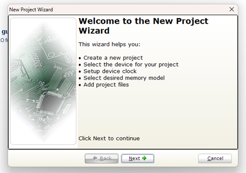

# _Configuração do Microcontrolador 8051_


---

## Sumário

- [Histórico de Versão](#histórico-de-versão)
- [Resumo](#resumo)
- [Links para estudos](#links-para-estudos)
- [Projetos](#projetos)
- [Informações Adicionais](#informações-adicionais)
    - [Configuração do Microcontrolador ATMEL AT89S52](#configuração-do-microcontrolador-atmel-at89s52)
    - [Exemplo do main para 8051](#exemplo-do-main-para-8051)

## Histórico de Versão

| Versão | Data       | Autor       | Descrição         |
|--------|------------|-------------|-------------------|
| 1.0.0  | 09/09/2024 | Adenilton R | Início do Projeto |

## Resumo

Este documento tem como objetivo fornecer orientações para a configuração do ambiente de trabalho para o microcontrolador ATMEL AT89S52.

## Links para estudos

[Informações do ATMEL AT89S52;](https://www.microchip.com/en-us/product/at89s52)

[Datasheet do microcontrolador;](https://ww1.microchip.com/downloads/en/DeviceDoc/doc1919.pdf)

[Vídeo de configuração do ambiente;](https://www.youtube.com/watch?v=QY_adW902Uw&t)

[Site de compra do ATMEL AT89S52;](https://www.saravati.com.br/microcontrolador-at89s52-24pu-dip-40-pin.html)

## Projetos

[1 - Pisca Led;](https://github.com/Facens-Cedeps/Projeto-Documentacao/tree/master/8051/ATMEL-AT89S52/1-Pisca-led)

[2 - Botão;](https://github.com/Facens-Cedeps/Projeto-Documentacao/tree/master/8051/ATMEL-AT89S52/2-Botao)

[3 - PWM;](https://github.com/Facens-Cedeps/Projeto-Documentacao/tree/master/8051/ATMEL-AT89S52/3-PWM)

[4 - Display de 7 Segmentos;](https://github.com/Facens-Cedeps/Projeto-Documentacao/tree/master/8051/ATMEL-AT89S52/4-Display-7-Seg)

## Informações Adicionais

Este documento apresentará os passos detalhados para a configuração do ambiente, incluindo os softwares necessários.

### Configuração do Microcontrolador ATMEL AT89S52

Inicie o software `MikroC PRO for 8051` e, em seguida, clique em `File` e selecione `New Project`:


Clique en `Next`:



Configure nome do projeto, local para salvar, seu microcontrolador e o Clocke e clique em `Next`:


Deixe em Small e clique em `Next`:


Clique em `Next`:


Clique em `Next`:


Clique em `Finish`:


### Exemplo do main para 8051

```c
/*
 * NOME: Nome
 * DATA: 12/09/2024
 * PROJETO: Nome do projeto
 * VERSAO: 01
 * DESCRICAO: - feat: Descrição.
 *            - docs: MikroC PRO for 8051 v3.6.0 - SIMIIDE 1.1.0
 * LINKS: 
*/

// ========================================================================================================
// ---INCLUDE---

// ========================================================================================================
//---BIBLIOTECAS AUXILIARES---

// ========================================================================================================
//---MAPEAMENTO DE ESTADO---

// ========================================================================================================
//---MAPEAMENTO DE HARDWARE---

// ========================================================================================================
//---VARIAVEIS GLOBAIS---

// ========================================================================================================
//---PROTOTIPO DA FUNCAO---

// ========================================================================================================
/**
 * @brief Void main
 *
 */
void main() {
     while(1) {
              //...
     }

}
```