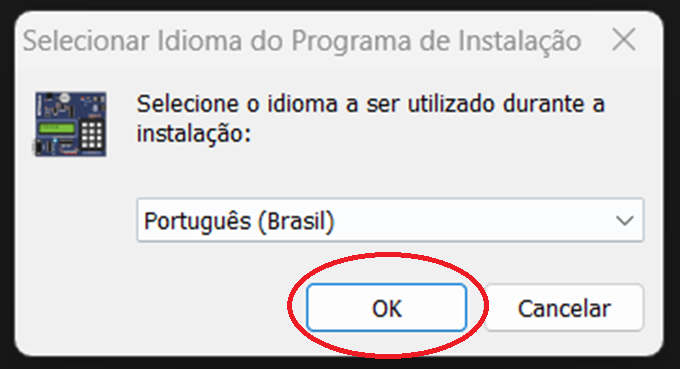
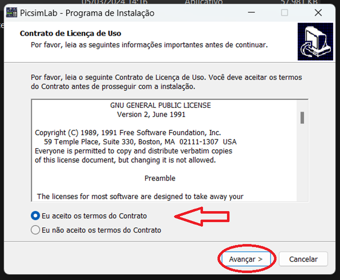
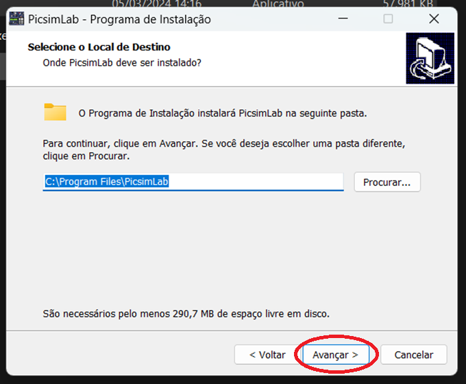
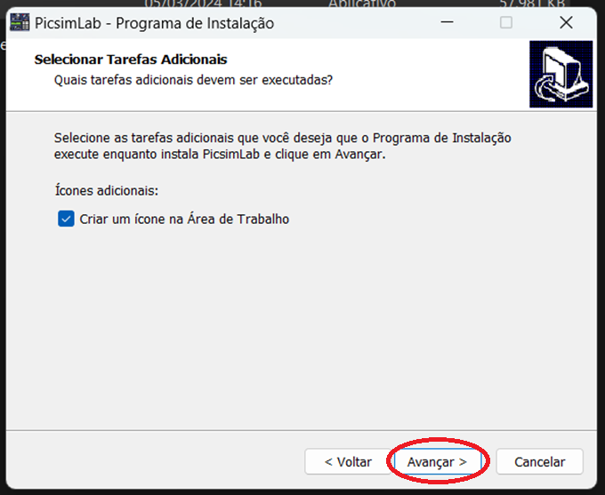
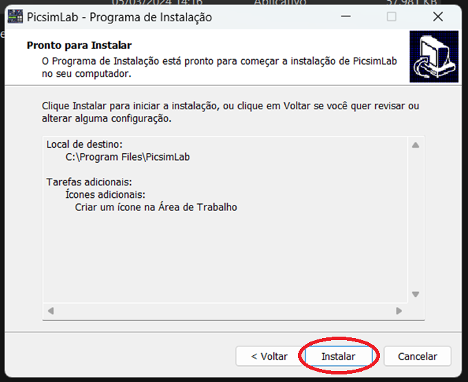
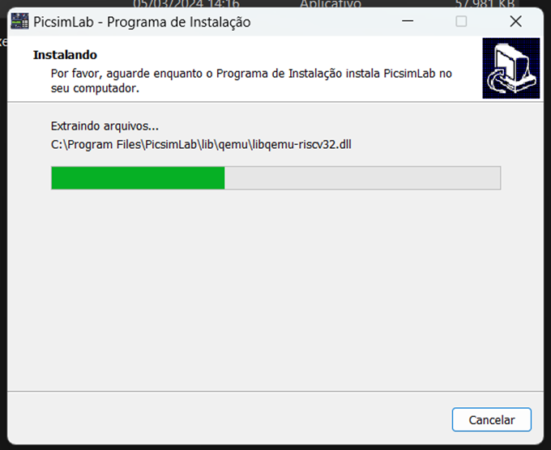
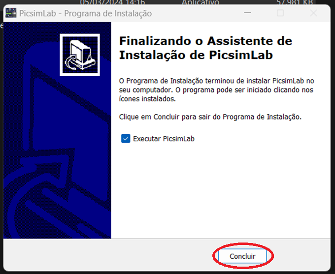

# _Configuração de Ambiente_

---

## Sumário

- [Histórico de Versão](#histórico-de-versão)
- [Resumo](#resumo)
- [Requisitos](#requisitos)
- [Informações Adicionais](#informações-adicionais)
    - [Instalação MikroC PRO for 8051](#instalação-mikroc-pro-for-8051)
    - [Instalação PICSimLab](#instalação-picsimlab)
- [Informações](#informações)

## Histórico de Versão

| Versão | Data       | Autor       | Descrição         |
|--------|------------|-------------|-------------------|
| 1.0.0  | 03/07/2025 | Adenilton R | Início do Projeto |

## Resumo

Este documento visa fornecer orientações para a instalação dos softwares necessários, incluindo o MikroC PRO for 8051,  e o Simulador SIMUIIDE, bem como para a configuração do microcontrolador na IDE MikroC. Cada exemplo de projeto será detalhadamente abordado, fornecendo instruções passo a passo para execução nos respectivos softwares mencionados.

## Requisitos

Softwares a serem instalados:

📥 [MikroC PRO for 8051](https://www.mikroe.com/mikroc-8051?srsltid=AfmBOopc2xZxeMrh-US4Qz6_vOXNgmxq8X2hel19F0kcMwG2A1uu6IS-)

📥 [PICSimLab](https://sourceforge.net/projects/picsim/)

Configuração do microcontrolador:

⚙️ [ATMEL AT89S51](https://github.com/AdeniltonR/Exemplos-de-firmware-para-8051/tree/main/ATMEL-AT89S52)

## Informações Adicionais

Este documento apresentará os passos detalhados para a instalação e configuração do ambiente, incluindo os softwares necessários.

### Instalação MikroC PRO for 8051

Para baixar software 📥 [**`MikroC PRO for 8051`**](https://www.mikroe.com/mikroc-8051?srsltid=AfmBOopc2xZxeMrh-US4Qz6_vOXNgmxq8X2hel19F0kcMwG2A1uu6IS-) :

Depois de baixar o software, basta clicar nele para abri-lo e seguir as instruções clicando em `Next>` conforme necessário:

### Instalação PICSimLab

Para baixar software 📥 [`PICSimLab`](https://sourceforge.net/projects/picsim/):

Depois de baixar o software, simplesmente selecione o idioma de sua preferência e clique em `OK`:

Na próxima página, clique em `Eu aceito os termos do Contrato`, em seguida, clique em `Avançar>`:

Na próxima página, selecione o diretório para salvar os arquivos e clique em `Avançar>`:

Na próxima página, selecione a opcão de sua preferencia e clique em `Avançar>`:

Na próxima página, clique em `Instalar`:

Na próxima página, aguarde a instalação do software:

Na próxima página, clique em `Concluir`:

E seu ambiente estará totalmente instalado. Para configurá-lo para o microcontrolador, basta acessar a página de [configuração MCU](https://github.com/AdeniltonR/Exemplos-de-firmware-para-8051/tree/main/Configuracao-MCU):

## Informações

| Software   | Versão |
|------------|--------|
| MikroC     | v3.6.0 |
| PICSimLab  | v0.9.1 |