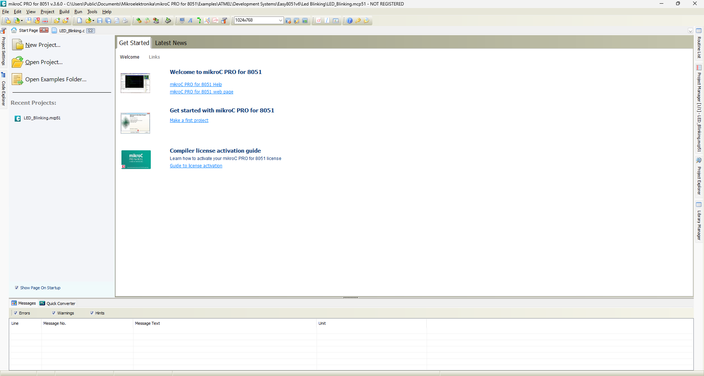
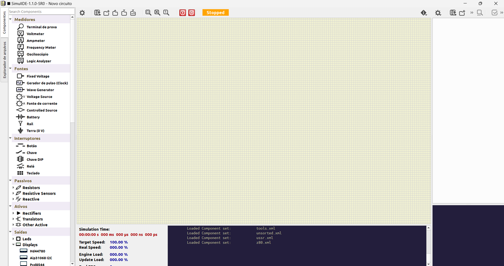

# _Configuração de Ambiente_

---

## Sumário

- [Histórico de Versão](#histórico-de-versão)
- [Resumo](#resumo)
- [Requisitos](#requisitos)
- [Informações Adicionais](#informações-adicionais)
    - [Instalação MikroC PRO for 8051](#instalação-mikroc-pro-for-8051)
    - [Instalação SIMU LIDE](#instalação-simu-lide)
- [Informações](#informações)

## Histórico de Versão

| Versão | Data       | Autor       | Descrição         |
|--------|------------|-------------|-------------------|
| 1.0.0  | 09/09/2024 | Adenilton R | Início do Projeto |

## Resumo

Este documento visa fornecer orientações para a instalação dos softwares necessários, incluindo o MikroC PRO for 8051,  e o Simulador SIMUIIDE, bem como para a configuração do microcontrolador na IDE MikroC. Cada exemplo de projeto será detalhadamente abordado, fornecendo instruções passo a passo para execução nos respectivos softwares mencionados.

## Requisitos

Softwares a serem instalados:

📥 [MikroC PRO for 8051](https://www.mikroe.com/mikroc-8051?srsltid=AfmBOopc2xZxeMrh-US4Qz6_vOXNgmxq8X2hel19F0kcMwG2A1uu6IS-)

📥 [SimuIlDE](https://simulide.com/p/)

Configuração do microcontrolador:

⚙️ [ATMEL AT89S52](https://us-east-1.console.aws.amazon.com/codesuite/codecommit/repositories/projetos.Documentacao.CEDEPS/browse/refs/heads/master/--/8051/Configuracao-MCU?region=us-east-1)

## Informações Adicionais

Este documento apresentará os passos detalhados para a instalação e configuração do ambiente, incluindo os softwares necessários.

### Instalação M**ikroC PRO for 8051**

Para baixar software 📥 [**`MikroC PRO for 8051`**](https://www.mikroe.com/mikroc-8051?srsltid=AfmBOopc2xZxeMrh-US4Qz6_vOXNgmxq8X2hel19F0kcMwG2A1uu6IS-) :

Depois de baixar o software, basta clicar nele para abri-lo e seguir as instruções clicando em `Next>` conforme necessário:

### Instalação SIMU LIDE

Para baixar software 📥 [**`SimuIlDE`**](https://simulide.com/p/), O arquivo pode ser encotrado no [**`SharePoint`**](https://facens.sharepoint.com/:f:/r/sites/CEDEPS/Documentos%20Compartilhados/07_Inova%C3%A7%C3%A3o/Programas/SIMULLDE?csf=1&web=1&e=M3gNCd):

Depois de baixar o software, basta clicar nele para abri-lo e seguir as instruções clicando em `Next>` conforme necessário:

E seu ambiente estará totalmente instalado. Para configurá-lo para o microcontrolador, basta acessar a página de [configuração MCU](https://us-east-1.console.aws.amazon.com/codesuite/codecommit/repositories/projetos.Documentacao.CEDEPS/browse/refs/heads/master/--/8051/Configuracao-MCU?region=us-east-1):

## Informações

| Software   | Versão |
|------------|--------|
| MikroC     | v3.6.0 |
| Simu IiDE  | v1.1.0 |